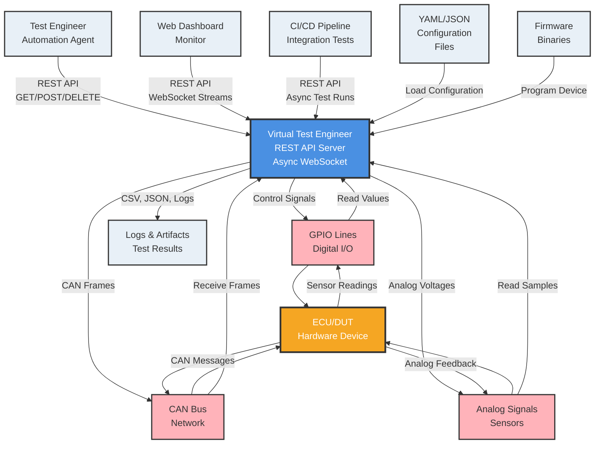

# Virtual Test Engineer

A software-defined test bench platform for automotive ECU testing and validation. This system provides a REST API for controlling hardware interfaces, executing test scenarios, and collecting sensor data in a configuration-driven, extensible architecture.

## Features

- **Software-Defined**: Hardware behavior defined through configuration files
- **Extensible**: Plugin architecture for adding new device types
- **Layered Control**: Low-level device commands + high-level test sequences
- **REST API**: HTTP interface for external agents and automation
- **Real-time**: Support for streaming sensor data and test execution
- **Configuration-Driven**: YAML/JSON setup for easy test bench reconfiguration
- **Firmware Flashing**: Built-in support for programming ECUs with various protocols

## System Context (C4 Diagram)



**Context Diagram Details**: Multiple external actors (test engineers, dashboards, CI/CD pipelines) interact with VTE via REST API and WebSocket. The system controls hardware interfaces (GPIO, CAN, Analog) connected to ECU/DUT and manages configuration/firmware files, producing test logs and artifacts.

## Documentation

📖 **[Complete User Guide](USER_GUIDE.md)** - Learn how to:
- Add new simulators (plugins)
- Configure DUT profiles
- Use the Python client library
- Extend the system with custom functionality

## Architecture

The system follows a layered architecture:

1. **Hardware Abstraction Layer (HAL)**: Direct hardware interface
2. **Device Manager**: Channel and instrument management
3. **Test Execution Engine**: Scenario orchestration
4. **Flashing Manager**: Firmware programming operations
5. **REST API Layer**: External HTTP interface

## Quick Start

### 1. Install Dependencies

```bash
pip install -r requirements.txt
```

### 2. Run the Server

```bash
python -m uvicorn src.api.endpoints:app --host 0.0.0.0 --port 8080
```

The API will be available at `http://localhost:8080`

### 3. Test the API

```bash
# Health check
curl http://localhost:8080/health

# List available channels
curl http://localhost:8080/channels

# Read a channel (if configured)
curl http://localhost:8080/channels/throttle_position

# List firmware files
curl http://localhost:8080/flash/files
```

### 4. Use the Python Client

```python
from client.vte_client import VirtualTestEngineerClient

async def main():
    async with VirtualTestEngineerClient() as client:
        # Check server health
        health = await client.health_check()
        print(f"Server status: {health['status']}")

        # List channels
        channels = await client.list_channels()
        print(f"Found {len(channels)} channels")

# Run the test script
python test_client.py
```

# Start a test scenario
curl -X POST http://localhost:8080/runs \
  -H "Content-Type: application/json" \
  -d '{"scenario_id": "throttle_response_test", "async": true}'
```

## Configuration

The test bench is configured via YAML files. See `config/testbench.yaml` for an example configuration.

### Example Configuration

```yaml
version: "1.0"
name: "Arduino_ECU_TestBench"

plugins:
  - name: "gpio_plugin"
    type: "gpio"
    config:
      pins: [2, 3, 4, 5, 6, 7, 8, 9]

instruments:
  - id: "throttle_sensor"
    plugin: "analog_plugin"
    type: "adc"
    channel: 0

channels:
  - id: "throttle_position"
    instrument: "throttle_sensor"
    scaling:
      input_range: [0.0, 5.0]
      output_range: [0, 100]
      units: "%"
```

## Plugin Development

Plugins extend the test bench with new hardware capabilities. Each plugin consists of:

- `plugin.json`: Manifest file with metadata and capabilities
- Python module implementing the `DevicePlugin` interface

### Example Plugin Structure

```
drivers/plugins/my_plugin/
├── plugin.json
└── my_driver.py
```

See `drivers/plugins/gpio_plugin/` and `drivers/plugins/analog_plugin/` for examples.

## API Documentation

### Core Endpoints

- `GET /health` - Health check
- `GET /bench` - Test bench information
- `GET /channels` - List channels
- `GET /channels/{id}` - Read channel
- `PUT /channels/{id}` - Write channel
- `POST /runs` - Start test run
- `GET /runs/{id}` - Get run status
- `DELETE /runs/{id}` - Abort run

### Test Scenarios

The system supports predefined test scenarios loaded from configuration. Example scenarios include:

- **Throttle Response Test**: Validates ECU throttle-to-engine-speed response
- **Eco/Sport Mode Test**: Tests different driving modes
- **CAN Communication Test**: Validates network message handling

## Development

### Project Structure

```
src/
├── core/           # Core system components
│   ├── types.py           # Type definitions
│   ├── plugin_manager.py  # Plugin management
│   ├── device_manager.py  # Device/channel management
│   ├── test_engine.py     # Test execution
│   └── test_bench.py      # Main test bench class
├── api/            # REST API
│   └── endpoints.py       # FastAPI endpoints
└── main.py         # Application entry point

drivers/plugins/    # Device plugins
config/            # Configuration files
specs/             # API specifications
```

### Running Tests

```bash
python -m pytest tests/
```

### Adding New Features

1. **New Device Type**: Create a plugin in `drivers/plugins/`
2. **New API Endpoint**: Add to `src/api/endpoints.py`
3. **New Test Scenario**: Extend `src/core/test_engine.py`
4. **Configuration Schema**: Update `config/testbench.yaml`

## Arduino ECU Example

The system includes support for Arduino-based ECUs with:

- **Throttle Input**: Analog voltage (0-5V) mapped to 0-100%
- **Engine Speed Output**: PWM signal representing RPM
- **Mode Switch**: Digital input for eco/sport modes
- **CAN Communication**: Network message handling

### Hardware Setup

```
Arduino Pin  A0 ─── Throttle Sensor (Analog)
Arduino Pin   9 ─── Engine Speed Output (PWM)
Arduino Pin   2 ─── Eco/Sport Mode Switch (Digital)
Arduino CAN ────── CAN Bus (Optional)
```

## License

This project is licensed under the MIT License - see the LICENSE file for details.