# Virtual Test Engineer Python Client

A comprehensive Python client library for interacting with the Virtual Test Engineer REST API, enabling automated testing of embedded systems and ECUs.

## Features

- **Async/Await Support**: Full async support for high-performance testing
- **Channel Operations**: Read/write analog and digital channels
- **Test Execution**: Start, monitor, and control automated test runs
- **Firmware Flashing**: Upload and flash firmware to target devices
- **Configuration Management**: Persistent client configuration
- **Error Handling**: Robust error handling and retry logic

## Detailed Client-Server Architecture

```mermaid
graph TB
    subgraph ClientLib["Python Client Library<br/>(vte_client package)"]
        
        subgraph ConfigMgmt["Configuration Management"]
            ConfigMgr["ConfigManager<br/>Load/Save config"]
            ConfigFile["~/.vte_client/<br/>config.json<br/>server_url<br/>timeout<br/>retry_attempts"]
        end
        
        subgraph AsyncClient["Async HTTP Client"]
            VteClient["VirtualTestEngineer<br/>Client<br/>async/await"]
            Connector["aiohttp.ClientSession<br/>Connection Pooling<br/>SSL Support"]
            Serializer["Request/Response<br/>Serializer<br/>JSON<br/>Pydantic"]  
        end
        
        subgraph Operations["High-Level Operations"]
            HEALTH["health_check()"]
            SYS_OPS["list_channels()<br/>get_channel_info()"]
            CH_OPS["read_channel()<br/>write_channel()"]
            STREAM["stream_channels()<br/>async generator"]
            TEST_OPS["run_test()<br/>get_test_status()"]
            FLASH_OPS["upload_firmware()<br/>flash_device()"]
        end
        
        subgraph ErrorHdl["Error Handling"]
            RETRY["RetryPolicy<br/>exponential backoff<br/>max_attempts"]
            EXCEPTION["VTEException<br/>ConnectionError<br/>TimeoutError"]
        end
        
        ConfigMgr -->|"Load"| ConfigFile
        VteClient -->|"Config"| ConfigMgr
        VteClient -->|"Pool"| Connector
        VteClient -->|"Serialize"| Serializer
        
        HEALTH -->|"Call"| VteClient
        SYS_OPS -->|"Call"| VteClient
        CH_OPS -->|"Call"| VteClient
        STREAM -->|"Subscribe"| VteClient
        TEST_OPS -->|"Call"| VteClient
        FLASH_OPS -->|"Call"| VteClient
        
        VteClient -->|"Retry"| RETRY
        VteClient -->|"Raise"| EXCEPTION
    end
    
    Network["Network Layer<br/>HTTP/1.1 + WebSocket<br/>TLS/SSL (optional)<br/>default localhost:8080"]
    
    subgraph ServerApp["FastAPI Server<br/>(REST API)"]
        
        subgraph ASGI["ASGI Application<br/>(Uvicorn)"]
            FastAPI_App["FastAPI()<br/>Async request handler<br/>Middleware stack"]
            Middleware["CORS, Auth, Logging<br/>Rate Limiting<br/>Request Timeout"]
        end
        
        subgraph HealthEndpoint["Health & Discovery"]
            HEALTH_EP["GET /health<br/>→ {'status': 'ok'}"]
            CONFIG_EP["GET /config<br/>→ testbench config<br/>plugins, channels"]
            DISCOVER_EP["GET /capabilities<br/>→ system features"]
        end
        
        subgraph ChannelEndpoint["Channel Operations"]
            LIST_CH["GET /channels<br/>→ list all channels"]
            READ_CH["GET /channels/{id}<br/>→ {'value': ...}"]
            WRITE_CH["POST /channels/{id}<br/>body:{'value': ...}"]
            STREAM_CH["WebSocket /stream<br/>→ continuous updates"]
        end
        
        subgraph TestEndpoint["Test Execution"]
            RUN_TEST["POST /runs<br/>body: test config<br/>→ run_id"]
            STATUS_TEST["GET /runs/{id}<br/>→ status, progress"]
            CANCEL_TEST["DELETE /runs/{id}<br/>→ stop test"]
            RESULTS_TEST["GET /results/{id}<br/>→ CSV, JSON, logs"]
        end
        
        subgraph FlashEndpoint["Firmware Operations"]
            LIST_FW["GET /flash/files<br/>→ available firmware"]
            UPLOAD_FW["POST /flash/upload<br/>multipart file upload"]
            FLASH_FW["POST /flash<br/>program device<br/>verify checksum"]
            STATUS_FW["GET /flash/status<br/>→ progress, result"]
        end
        
        subgraph CoreEngine["Core Engine"]
            DeviceManager["Device Manager<br/>Channel registry<br/>Plugin orchestration<br/>State caching"]
            TestExecutor["Test Executor<br/>Scenario parser<br/>Step execution<br/>Conditional logic"]
            FlashManager["Flash Manager<br/>Protocol handlers<br/>UART, JTAG, SPI<br/>Verification"]
            DataLogger["Data Logger<br/>CSV writer<br/>JSON export<br/>Artifact generation"]
        end
        
        FastAPI_App -->|"Route"| Middleware
        Middleware -->|"Dispatch"| HEALTH_EP
        Middleware -->|"Dispatch"| LIST_CH
        Middleware -->|"Dispatch"| READ_CH
        Middleware -->|"Dispatch"| WRITE_CH
        Middleware -->|"Dispatch"| STREAM_CH
        Middleware -->|"Dispatch"| RUN_TEST
        Middleware -->|"Dispatch"| FLASH_FW
        
        HEALTH_EP -->|"Query"| DeviceManager
        CONFIG_EP -->|"Query"| DeviceManager
        LIST_CH -->|"Query"| DeviceManager
        READ_CH -->|"Read value"| DeviceManager
        WRITE_CH -->|"Write value"| DeviceManager
        STREAM_CH -->|"Subscribe"| DeviceManager
        RUN_TEST -->|"Execute"| TestExecutor
        STATUS_TEST -->|"Query"| TestExecutor
        RESULTS_TEST -->|"Fetch"| DataLogger
        UPLOAD_FW -->|"Store"| FlashManager
        FLASH_FW -->|"Program"| FlashManager
    end
    
    subgraph Hardware["Hardware Layer"]
        ECU["ECU / DUT<br/>(Device Under Test)"]
        GPIO_HW["GPIO Lines<br/>Digital I/O"]
        CAN_HW["CAN Bus<br/>Network Interface"]
        ANALOG_HW["Analog Signals<br/>Sensors/Actuators"]
    end
    
    HEALTH -->|"HTTP GET"| Network
    SYS_OPS -->|"HTTP GET"| Network
    CH_OPS -->|"HTTP GET/POST"| Network
    STREAM -->|"WebSocket"| Network
    TEST_OPS -->|"HTTP POST/GET"| Network
    FLASH_OPS -->|"HTTP POST"| Network
    
    Network -->|"HTTP"| FastAPI_App
    Network -->|"WebSocket"| STREAM_CH
    
    DeviceManager -->|"Control"| GPIO_HW
    DeviceManager -->|"Control"| CAN_HW
    DeviceManager -->|"Sample"| ANALOG_HW
    TestExecutor -->|"Read/Write"| DeviceManager
    FlashManager -->|"Program"| ECU
    DataLogger -->|"Log"| Artifacts["Output Files<br/>CSV, JSON, Logs"]
    
    GPIO_HW -->|"Connected to"| ECU
    CAN_HW -->|"Connected to"| ECU
    ANALOG_HW -->|"Connected to"| ECU
    
    ECU -->|"Feedback"| GPIO_HW
    ECU -->|"Messages"| CAN_HW
    ECU -->|"Sensor Data"| ANALOG_HW
    
    STREAM_CH -->|"Broadcast<br/>to client"| Serializer
    
    style ClientLib fill:#4A90E2,stroke:#333,stroke-width:2px,color:#fff
    style ConfigMgmt fill:#50E3C2,stroke:#333,stroke-width:1px
    style AsyncClient fill:#50E3C2,stroke:#333,stroke-width:1px
    style Operations fill:#50E3C2,stroke:#333,stroke-width:1px
    style ErrorHdl fill:#50E3C2,stroke:#333,stroke-width:1px
    style ServerApp fill:#B8E986,stroke:#333,stroke-width:2px
    style ASGI fill:#50E3C2,stroke:#333,stroke-width:1px
    style HealthEndpoint fill:#F8E71C,stroke:#333,stroke-width:1px
    style ChannelEndpoint fill:#F8E71C,stroke:#333,stroke-width:1px
    style TestEndpoint fill:#F8E71C,stroke:#333,stroke-width:1px
    style FlashEndpoint fill:#F8E71C,stroke:#333,stroke-width:1px
    style CoreEngine fill:#50E3C2,stroke:#333,stroke-width:1px
    style Hardware fill:#F5A623,stroke:#333,stroke-width:2px,color:#fff
    style Network fill:#B8E986,stroke:#333,stroke-width:2px
    style Artifacts fill:#E8F0F7,stroke:#333,stroke-width:2px
```



**C4 Container Diagram - Detailed Client-Server Architecture**:
- **Client Library**: Configuration management, async HTTP/WebSocket, type-safe operations, retry logic
- **API Endpoints**: Health, channels (read/write/stream), test execution, firmware operations
- **Core Engine**: Device Manager (orchestration), Test Executor (scenario running), Flash Manager, Data Logger
- **Data Flow**: Client async calls → HTTP/WebSocket → Server endpoints → Core engine → Hardware control
- **Output**: Test results, logs, and artifacts streamed back to client

## Installation

### From Source

```bash
cd client
pip install -e .
```

### Requirements

- Python 3.8+
- aiohttp
- pydantic

## Quick Start

```python
import asyncio
from vte_client import VirtualTestEngineerClient

async def main():
    async with VirtualTestEngineerClient("http://localhost:8080") as client:
        # Health check
        health = await client.health_check()
        print(f"Server status: {health['status']}")

        # List channels
        channels = await client.list_channels()
        print(f"Found {len(channels)} channels")

        # Read a channel
        if channels:
            channel_info = await client.read_channel(channels[0].id)
            print(f"Channel {channel_info.id}: {channel_info.value}")

asyncio.run(main())
```

## Configuration

Create a configuration file at `~/.vte_client/config.json`:

```json
{
  "server_url": "http://localhost:8080",
  "timeout": 30.0,
  "retry_attempts": 3,
  "log_level": "INFO",
  "default_test_timeout": 300.0,
  "default_flash_timeout": 300.0
}
```

Or configure programmatically:

```python
from config_manager import ConfigManager

config_manager = ConfigManager()
config = config_manager.load_config()
config.server_url = "http://your-server:8080"
config_manager.save_config()
```

## API Reference

### Client Class

#### `VirtualTestEngineerClient(base_url="http://localhost:8080")`

Main client class for interacting with the Virtual Test Engineer API.

#### Health & Status Methods

- `health_check()` - Check system health
- `get_bench_info()` - Get test bench information
- `get_capabilities()` - Get system capabilities

#### Channel Methods

- `list_channels()` - List all available channels
- `read_channel(channel_id)` - Read a specific channel
- `write_channel(channel_id, value)` - Write to a channel
- `read_multiple_channels(channel_ids)` - Read multiple channels

#### Test Methods

- `start_test(test_config)` - Start a test run
- `get_test_status(test_id)` - Get test status
- `stop_test(test_id)` - Stop a test run
- `list_tests()` - List all test runs

#### Flashing Methods

- `list_firmware_files()` - List uploaded firmware files
- `upload_firmware(file_path, description, version)` - Upload firmware
- `start_flash(file_id, protocol, target_device, parameters)` - Start flash operation
- `get_flash_status(flash_id)` - Get flash status
- `cancel_flash(flash_id)` - Cancel flash operation

#### Utility Methods

- `wait_for_flash_completion(flash_id, timeout, poll_interval)` - Wait for flash completion
- `wait_for_test_completion(test_id, timeout, poll_interval)` - Wait for test completion

## Example Applications

### Channel Monitoring

```python
async def monitor_channels():
    async with VirtualTestEngineerClient() as client:
        channels = await client.list_channels()

        while True:
            readings = await client.read_multiple_channels([ch.id for ch in channels])
            for reading in readings:
                print(f"{reading.id}: {reading.value} {reading.units}")
            await asyncio.sleep(1.0)
```

### Automated Test

```python
async def run_ecu_test():
    test_config = {
        "name": "ECU Functionality Test",
        "dut_profile": "arduino_ecu",
        "steps": [
            {
                "id": "set_throttle",
                "type": "channel_write",
                "parameters": {"channel_id": "throttle_position", "value": 75.0}
            },
            {
                "id": "read_response",
                "type": "channel_read",
                "parameters": {"channel_id": "engine_speed"}
            },
            {
                "id": "validate",
                "type": "assert",
                "parameters": {
                    "condition": "engine_speed > 2000",
                    "message": "Engine speed should exceed 2000 RPM"
                }
            }
        ]
    }

    async with VirtualTestEngineerClient() as client:
        test_id = await client.start_test(test_config)
        result = await client.wait_for_test_completion(test_id)
        print(f"Test result: {result['status']}")
```

### Firmware Flashing

```python
async def flash_firmware():
    async with VirtualTestEngineerClient() as client:
        # Upload firmware
        upload = await client.upload_firmware(
            "firmware.hex",
            description="Latest ECU firmware",
            version="2.1.0"
        )

        # Start flash operation
        flash_id = await client.start_flash(
            upload['file_id'],
            "avrdude",
            "atmega328p",
            {"port": "/dev/ttyUSB0"}
        )

        # Wait for completion
        result = await client.wait_for_flash_completion(flash_id)
        print(f"Flash result: {result['status']}")
```

## Command Line Usage

The client includes a command-line example application:

```bash
# Run all tests
python example_client.py

# Test only channels
python example_client.py --test channels

# Use different server
python example_client.py --server http://test-server:8080
```

## Error Handling

The client includes comprehensive error handling:

```python
try:
    async with VirtualTestEngineerClient() as client:
        result = await client.read_channel("nonexistent_channel")
except Exception as e:
    print(f"Error: {e}")
```

## Contributing

1. Fork the repository
2. Create a feature branch
3. Add tests for new functionality
4. Ensure all tests pass
5. Submit a pull request

## License

MIT License - see LICENSE file for details