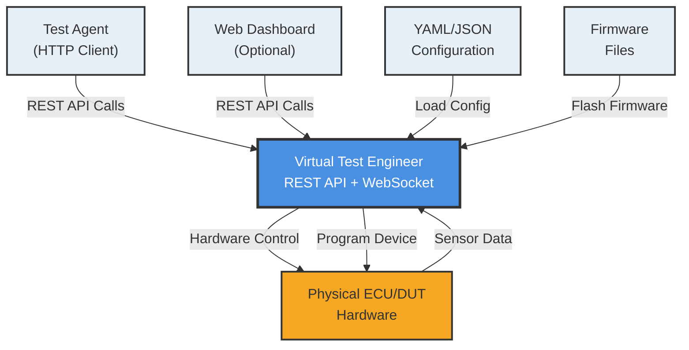
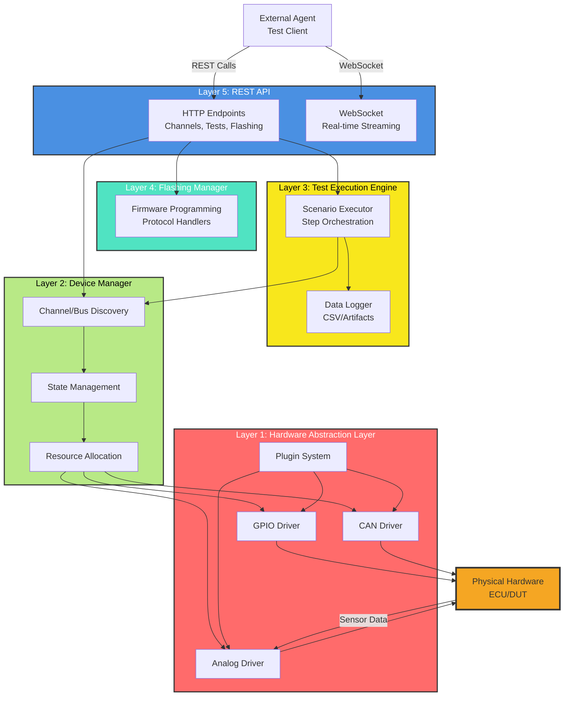
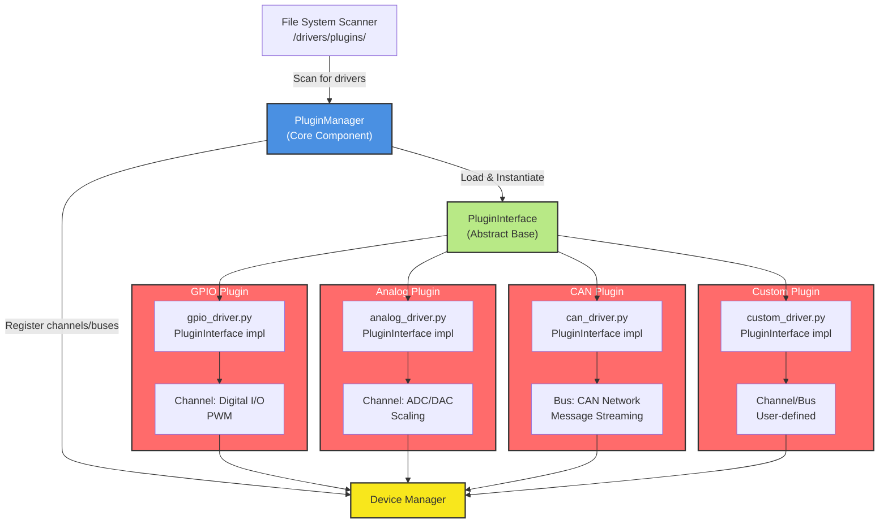

# 01_Architecture.md - High-Level Design and Component Layers

## Overview

The Virtual Test Engineer is a software-defined test bench platform designed for automotive ECU (Electronic Control Unit) testing and validation. It provides a REST API for controlling hardware interfaces, executing test scenarios, and collecting sensor data in a configuration-driven, extensible architecture.

## Core Philosophy

- **Software-Defined**: Hardware behavior is defined through configuration files, not hardcoded logic
- **Extensible**: Plugin architecture allows adding new device types without modifying core code
- **Layered Control**: Supports both low-level device commands and high-level test sequences
- **Configuration-Driven**: Test bench setup via YAML/JSON files enables easy reconfiguration for different DUTs

## System Context Diagram



## Component Architecture

### 1. Hardware Abstraction Layer (HAL)
- **Purpose**: Abstracts physical hardware interfaces from application logic
- **Components**:
  - GPIO Controller: Digital I/O management
  - ADC/DAC Interface: Analog signal handling
  - CAN Transceiver: Automotive network communication
  - PWM Controller: Timing and pulse-width modulation
- **Dual-File Architecture**: Separate interface definitions and implementations

### 2. Device Manager
- **Purpose**: Manages device lifecycle and plugin loading
- **Responsibilities**:
  - Plugin discovery and loading from `/drivers/plugins/`
  - Device initialization and calibration
  - Channel mapping and validation
  - Resource allocation and conflict resolution

### 3. Test Execution Engine
- **Purpose**: Orchestrates test scenario execution
- **Features**:
  - Step-by-step scenario execution
  - Conditional logic and branching
  - Sensor data collection and logging
  - Artifact generation (CSV, logs, screenshots)
  - Both synchronous and asynchronous execution modes

### 4. REST API Layer
- **Purpose**: Provides HTTP interface for external agents
- **Capabilities**:
  - Discovery endpoints for capabilities and status
  - Channel control for I/O operations
  - Scenario management and execution
  - Real-time streaming via WebSocket
  - Configuration validation and loading
### Layered Architecture Diagram


## Plugin Architecture

### Plugin Discovery
- Plugins are stored in `/drivers/plugins/` directory
- Each plugin is a Python module with a driver class implementing `PluginInterface`
- Automatic discovery and loading at startup via filesystem scanning
- No manifest files required - discovery based on class attributes

### Plugin Interface Contract
```python
from abc import ABC, abstractmethod
from typing import Dict, Any, Optional, List

class PluginInterface(ABC):
    """Abstract base class for all test bench plugins."""

    @abstractmethod
    def initialize(self, config: Dict[str, Any]) -> bool:
        """Initialize the plugin with configuration parameters."""
        pass

    @abstractmethod
    def shutdown(self) -> None:
        """Clean up plugin resources and close connections."""
        pass

    @abstractmethod
    def create_channel(self, channel_config: Dict[str, Any]) -> Optional[Channel]:
        """Create a channel instance for the specified configuration."""
        pass

    @abstractmethod
    def create_bus(self, bus_config: Dict[str, Any]) -> Optional[Bus]:
        """Create a bus instance for the specified configuration."""
        pass

    @property
    @abstractmethod
    def plugin_type(self) -> str:
        """Return the plugin type identifier."""
        pass

    @property
    @abstractmethod
    def supported_channel_types(self) -> List[str]:
        """Return list of supported channel types."""
        pass

    @property
    @abstractmethod
    def supported_bus_types(self) -> List[str]:
        """Return list of supported bus types."""
        pass
```

### Supported Plugin Types
- **GPIO Plugin**: Digital I/O control with PWM support
- **Analog Plugin**: ADC/DAC operations with scaling
- **CAN Plugin**: Network message handling with streaming
- **Custom Plugins**: User-defined device types via plugin interface

### Plugin Integration Component Diagram



## Configuration Lifecycle

1. **Load**: Parse YAML configuration files using PyYAML
2. **Validate**: Check plugin availability, resource conflicts, and schema validation
3. **Initialize**: Load plugins dynamically and create device instances
4. **Calibrate**: Apply scaling factors and limits from configuration
5. **Execute**: Run test scenarios with async execution and real-time monitoring

## Data Flow

```
Agent Request → FastAPI Routes → Test Engine → Device Manager → Plugin → Hardware
                                      ↓
Sensor Data ← Plugin ← Device Manager ← Test Engine ← FastAPI ← Agent Response
                                      ↓
WebSocket Streaming ← Real-time Updates
```

## State Management

- **Test Bench State**: idle, configuring, running, error, shutdown
- **Channel State**: cached values with timestamps, last read/write times
- **Execution State**: scenario progress, step results, artifacts, error tracking
- **Plugin State**: loaded, initialized, error states with recovery options

## Security Considerations

- Input validation using Pydantic models on all API endpoints
- Configuration file integrity checks with schema validation
- Resource limits to prevent hardware damage (configurable ranges)
- Optional authentication for multi-user deployments (extensible)
- CORS support for web-based agents

## Performance Characteristics

- **Latency**: <5ms for channel operations (async I/O)
- **Throughput**: 1000+ CAN messages/second with streaming
- **Concurrent Channels**: Up to 128 digital + 16 analog (configurable)
- **Logging Rate**: Configurable, up to 1000 samples/second with CSV export
- **Memory Usage**: ~50MB base + 10MB per active plugin
- **CPU Usage**: <5% for typical test scenarios