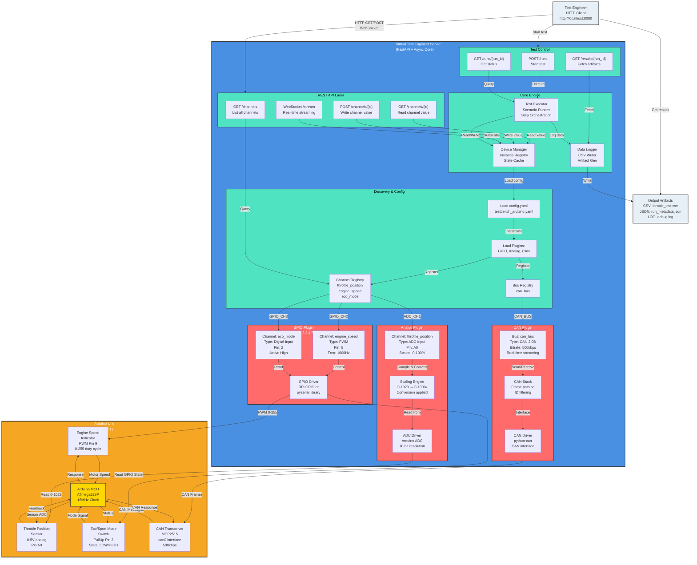

# 04_Examples.md - Real-World Usage Examples

## Arduino ECU Throttle Control Example

### Detailed System Architecture Diagram



**C4 Container Diagram - Arduino Throttle Control Example**:
- **REST API**: Channel list/read/write/stream endpoints for external control
- **Plugins**: GPIO for PWM/digital, Analog for ADC throttle sensor, CAN for network communication
- **Channels**: throttle_position (0-100%), engine_speed (PWM 0-100), eco_mode (digital)
- **Hardware**: Arduino with throttle sensor, PWM output, mode switch, CAN transceiver
- **Data Flow**: Requests → Plugins → Hardware → Sensor feedback → Logging

### Hardware Setup
- Arduino Uno with throttle position sensor (analog input A0)
- PWM output pin 9 connected to engine speed indicator
- Digital input pin 2 for eco/sport mode switch
- CAN transceiver for network communication

### Test Bench Configuration

```yaml
version: "1.0"
name: "Arduino_ECU_TestBench"

plugins:
  - name: "arduino_gpio"
    type: "gpio"
    config:
      pins: [2, 3, 4, 5, 6, 7, 8, 9]

  - name: "arduino_analog"
    type: "analog"
    config:
      adc_channels: [0, 1, 2, 3]
      dac_channels: []

  - name: "arduino_can"
    type: "can"
    config:
      interface: "can0"
      bitrate: 500000

instruments:
  - id: "throttle_sensor"
    plugin: "arduino_analog"
    type: "adc"
    channel: 0

  - id: "engine_speed_output"
    plugin: "arduino_gpio"
    type: "pwm"
    pin: 9

  - id: "mode_switch"
    plugin: "arduino_gpio"
    type: "digital_input"
    pin: 2

channels:
  - id: "throttle_position"
    instrument: "throttle_sensor"
    scaling:
      input_range: [0, 1023]
      output_range: [0, 100]
      units: "%"

  - id: "engine_speed"
    instrument: "engine_speed_output"
    config:
      frequency: 1000
      duty_cycle_range: [0, 100]
    scaling:
      output_range: [0, 8000]
      units: "rpm"

  - id: "eco_mode"
    instrument: "mode_switch"
    active_high: true

buses:
  - id: "can_bus"
    plugin: "arduino_can"
    bitrate: 500000

dut_profiles:
  - id: "arduino_throttle_ecu"
    channels: ["throttle_position", "engine_speed", "eco_mode"]
    buses: ["can_bus"]
```

## Test Scenario Examples

### Basic Throttle Response Test

```yaml
version: "1.0"
id: "throttle_response_basic"
name: "Basic Throttle Response Test"

steps:
  - id: "set_throttle_50"
    type: "set_channel"
    channel: "throttle_position"
    value: 50

  - id: "wait_settle"
    type: "delay"
    duration: 2000

  - id: "read_engine_speed"
    type: "read_channel"
    channel: "engine_speed"
    variable: "engine_speed"

  - id: "assert_response"
    type: "assert"
    condition: "${engine_speed} > 4.5 && ${engine_speed} < 5.5"
    message: "Engine speed not within expected range"

artifacts:
  - type: "csv"
    filename: "throttle_test.csv"
    channels: ["throttle_position", "engine_speed"]
    sample_rate: 10
```

### Eco vs Sport Mode Comparison

```yaml
version: "1.0"
id: "eco_sport_comparison"
name: "Eco vs Sport Mode Engine Response"

parameters:
  throttle_test_points: [25, 50, 75]
  modes: ["eco", "sport"]

steps:
  - id: "mode_comparison"
    type: "loop"
    variable: "mode"
    values: "${parameters.modes}"
    steps:
      - id: "set_mode"
        type: "set_channel"
        channel: "eco_mode"
        value: "${mode == 'sport'}"

      - id: "throttle_sweep"
        type: "loop"
        variable: "throttle"
        values: "${parameters.throttle_test_points}"
        steps:
          - id: "set_throttle"
            type: "set_channel"
            channel: "throttle_position"
            value: "${throttle}"

          - id: "stabilize"
            type: "delay"
            duration: 3000

          - id: "measure_response"
            type: "read_channel"
            channel: "engine_speed"
            variable: "speed_${mode}_${throttle}"

          - id: "log_measurement"
            type: "log"
            message: "${mode} mode, ${throttle}% throttle: ${speed_${mode}_${throttle}} rpm"
```

## API Usage Examples

### Synchronous Test Execution

```bash
# Start test run synchronously
curl -X POST http://localhost:8080/api/v1/runs \
  -H "Content-Type: application/json" \
  -d '{
    "scenario_id": "throttle_response_basic",
    "async": false
  }'

# Response includes complete results
{
  "run_id": "550e8400-e29b-41d4-a716-446655440000",
  "status": "completed",
  "results": { ... }
}
```

### Asynchronous Test Execution with Monitoring

```bash
# Start async test run
curl -X POST http://localhost:8080/api/v1/runs \
  -H "Content-Type: application/json" \
  -d '{
    "scenario_id": "eco_sport_comparison",
    "async": true
  }'

# Returns run ID immediately
{
  "run_id": "550e8400-e29b-41d4-a716-446655440000",
  "status": "queued"
}

# Poll for status
curl http://localhost:8080/api/v1/runs/550e8400-e29b-41d4-a716-446655440000

# Get final results
curl http://localhost:8080/api/v1/runs/550e8400-e29b-41d4-a716-446655440000/results
```

### Real-time Channel Monitoring

```javascript
// WebSocket connection for real-time updates
const ws = new WebSocket('ws://localhost:8080/api/v1/channels/throttle_position/stream');

ws.onmessage = (event) => {
  const data = JSON.parse(event.data);
  console.log(`Throttle: ${data.value}% at ${data.timestamp}`);
};
```

### CAN Message Monitoring

```javascript
// Monitor CAN bus traffic
const canWs = new WebSocket('ws://localhost:8080/api/v1/buses/can_bus/can/stream');

canWs.onmessage = (event) => {
  const msg = JSON.parse(event.data);
  if (msg.message_id === 0x100) {
    console.log('Engine speed message:', msg.data);
  }
};
```

### Direct Channel Control

```bash
# Read throttle position
curl http://localhost:8080/api/v1/channels/throttle_position

# Set throttle to 75%
curl -X PUT http://localhost:8080/api/v1/channels/throttle_position \
  -H "Content-Type: application/json" \
  -d '{"value": 75}'

# Read engine speed response
curl http://localhost:8080/api/v1/channels/engine_speed
```

### CAN Message Transmission

```bash
# Send engine control message
curl -X POST http://localhost:8080/api/v1/buses/can_bus/can/transmit \
  -H "Content-Type: application/json" \
  -d '{
    "message_id": 256,
    "data": [0x00, 0x00, 0x4E, 0x20]
  }'
```

## Configuration Validation

```bash
# Validate test bench configuration
curl -X POST http://localhost:8080/api/v1/config/validate \
  -H "Content-Type: application/json" \
  -d @testbench_config.yaml

# Validate test scenario
curl -X POST http://localhost:8080/api/v1/scenarios/throttle_test/validate
```

## Artifact Retrieval

```bash
# List artifacts from test run
curl http://localhost:8080/api/v1/artifacts/runs/550e8400-e29b-41d4-a716-446655440000

# Download CSV data
curl -o throttle_data.csv \
  http://localhost:8080/api/v1/artifacts/runs/550e8400-e29b-41d4-a716-446655440000/throttle_response.csv
```

## Error Handling Example

```bash
# Attempt to set invalid channel value
curl -X PUT http://localhost:8080/api/v1/channels/throttle_position \
  -H "Content-Type: application/json" \
  -d '{"value": 150}'

# Response
{
  "error": {
    "code": "VALIDATION_ERROR",
    "message": "Channel value 150 exceeds maximum allowed value 100",
    "details": {
      "channel": "throttle_position",
      "provided_value": 150,
      "max_value": 100
    }
  }
}
```