# 05_PluginInterface.md - Plugin Interface Specification

## Overview

The Virtual Test Engineer uses a plugin architecture to support different types of hardware interfaces and instruments. Plugins are dynamically loaded at runtime and provide standardized interfaces for channel operations, bus communication, and device management.

## Detailed Plugin Architecture - Lifecycle & Interface Diagram

```mermaid
graph TD
    Config["YAML Configuration<br/>plugins section"]
    START["Application Startup"]
    
    subgraph Phase1["Phase 1: Discovery"]
        FS["FileSystem Scanner<br/>/drivers/plugins/"]
        DIR_SCAN["Enumerate plugin<br/>directories"]
        INSPECT["Inspect __init__.py<br/>and module files"]
    end
    
    subgraph Phase2["Phase 2: Loading"]
        PY_IMPORT["Python import<br/>sys.path manipulation"]
        CLASS_DETECT["Detect PluginInterface<br/>subclasses"]
        ATTR_CHECK["Check plugin_type<br/>supported_types"]
    end
    
    subgraph Phase3["Phase 3: Instantiation"]
        INSTANTIATE["Create Plugin<br/>Instance"]
        INIT_CALL["Call initialize()<br/>with config"]
        STATE_SET["Set plugin_state<br/>to LOADED"]
    end
    
    subgraph Interface["PluginInterface Contract"]
        BASE["Abstract Base:<br/>PluginInterface"]
        
        INIT_METHOD["initialize(config)<br/>→ bool"]
        SHUTDOWN_METHOD["shutdown()<br/>→ None"]
        
        CREATE_CH["create_channel<br/>(config)<br/>→ Optional[Channel]"]
        CREATE_BUS["create_bus<br/>(config)<br/>→ Optional[Bus]"]
        
        TYPE_PROP["@property<br/>plugin_type: str"]
        CH_TYPES["@property<br/>supported_channel_types<br/>: List[str]"]
        BUS_TYPES["@property<br/>supported_bus_types<br/>: List[str]"]
    end
    
    subgraph GPIO_IMPL["GPIO Plugin<br/>(gpio_driver.py)"]
        GPIO_CLASS["class GPIOPlugin<br/>(PluginInterface)"]
        GPIO_INIT["initialize():<br/>Setup GPIO lib<br/>Configure pins"]
        GPIO_SHUT["shutdown():<br/>Cleanup pins<br/>Release resources"]
        GPIO_CH_CREATE["create_channel():<br/>Return DigitalChannel<br/>or PWMChannel"]
        GPIO_BUS_CREATE["create_bus():<br/>Return None<br/>(no bus)"]
        GPIO_TYPE["plugin_type:<br/>'gpio'"]
        GPIO_TYPES["supported_channel_types:<br/>['digital', 'pwm']"]
    end
    
    subgraph ANALOG_IMPL["Analog Plugin<br/>(analog_driver.py)"]
        ANALOG_CLASS["class AnalogPlugin<br/>(PluginInterface)"]
        ANALOG_INIT["initialize():<br/>Init ADC/DAC<br/>Set sampling"]
        ANALOG_SHUT["shutdown():<br/>Close converters"]
        ANALOG_CH_CREATE["create_channel():<br/>Return ADCChannel<br/>or DACChannel"]
        ANALOG_BUS_CREATE["create_bus():<br/>Return None<br/>(no bus)"]
        ANALOG_TYPE["plugin_type:<br/>'analog'"]
        ANALOG_TYPES["supported_channel_types:<br/>['adc', 'dac']"]
    end
    
    subgraph CAN_IMPL["CAN Plugin<br/>(can_driver.py)"]
        CAN_CLASS["class CANPlugin<br/>(PluginInterface)"]
        CAN_INIT["initialize():<br/>Setup CAN interface<br/>Configure bitrate"]
        CAN_SHUT["shutdown():<br/>Close CAN socket"]
        CAN_CH_CREATE["create_channel():<br/>Return CANChannel<br/>(single msg)"]
        CAN_BUS_CREATE["create_bus():<br/>Return CANBus<br/>(msg streaming)"]
        CAN_TYPE["plugin_type:<br/>'can'"]
        CAN_TYPES["supported_bus_types:<br/>['can', 'can_fd']"]
    end
    
    INSTANCES["Channel/Bus Instances<br/>(Created channels<br/>registered with<br/>Device Manager)"]
    
    START -->|"Load config"| Config
    Config -->|"List plugins"| Phase1
    FS -->|"Traverse dirs"| DIR_SCAN
    DIR_SCAN -->|"Get modules"| INSPECT
    INSPECT -->|"Ready to load"| Phase2
    
    PY_IMPORT -->|"Import modules"| CLASS_DETECT
    CLASS_DETECT -->|"Find subclass"| ATTR_CHECK
    ATTR_CHECK -->|"Validated"| Phase3
    
    INSTANTIATE -->|"__init__()"| Phase3
    INIT_CALL -->|"Config passed"| Phase3
    STATE_SET -->|"LOADED"| Phase3
    
    BASE --> INIT_METHOD
    BASE --> SHUTDOWN_METHOD
    BASE --> CREATE_CH
    BASE --> CREATE_BUS
    BASE --> TYPE_PROP
    BASE --> CH_TYPES
    BASE --> BUS_TYPES
    
    INIT_METHOD -.->|"implements"| GPIO_INIT
    INIT_METHOD -.->|"implements"| ANALOG_INIT
    INIT_METHOD -.->|"implements"| CAN_INIT
    
    CREATE_CH -.->|"implements"| GPIO_CH_CREATE
    CREATE_CH -.->|"implements"| ANALOG_CH_CREATE
    CREATE_CH -.->|"implements"| CAN_CH_CREATE
    
    GPIO_CLASS -->|"is-a"| BASE
    ANALOG_CLASS -->|"is-a"| BASE
    CAN_CLASS -->|"is-a"| BASE
    
    GPIO_CLASS -->|"instances"| INSTANCES
    ANALOG_CLASS -->|"instances"| INSTANCES
    CAN_CLASS -->|"instances"| INSTANCES
    
    style Phase1 fill:#50E3C2,stroke:#333,stroke-width:1px,color:#000
    style Phase2 fill:#50E3C2,stroke:#333,stroke-width:1px,color:#000
    style Phase3 fill:#50E3C2,stroke:#333,stroke-width:1px,color:#000
    style Interface fill:#B8E986,stroke:#333,stroke-width:2px
    style GPIO_IMPL fill:#FF6B6B,stroke:#333,stroke-width:2px,color:#fff
    style ANALOG_IMPL fill:#FF6B6B,stroke:#333,stroke-width:2px,color:#fff
    style CAN_IMPL fill:#FF6B6B,stroke:#333,stroke-width:2px,color:#fff
    style BASE fill:#B8E986,stroke:#333,stroke-width:2px
    style INSTANCES fill:#F8E71C,stroke:#333,stroke-width:2px
```



**C4 Component Diagram - Plugin Lifecycle & Interface**:
- **Phase 1 (Discovery)**: Scan `/drivers/plugins/`, find subdirectories and modules
- **Phase 2 (Loading)**: Import Python modules, detect PluginInterface subclasses
- **Phase 3 (Instantiation)**: Create instances, call initialize() with config
- **Interface Contract**: 7 abstract methods that all plugins must implement
- **Implementations**: GPIO, Analog, CAN plugins showing how each implements the interface

## Plugin Discovery

Plugins are discovered through filesystem scanning of the `/drivers/plugins/` directory. Each plugin must be in its own subdirectory with the following structure:

```
drivers/plugins/
├── gpio_plugin/
│   ├── __init__.py
│   ├── gpio_driver.py
│   └── config.yaml (optional)
├── analog_plugin/
│   ├── __init__.py
│   ├── analog_driver.py
│   └── config.yaml (optional)
└── can_plugin/
    ├── __init__.py
    ├── can_driver.py
    └── config.yaml (optional)
```

## Plugin Interface Contract

All plugins must implement the `PluginInterface` abstract base class defined in `src/core/types.py`.

```python
from abc import ABC, abstractmethod
from typing import Dict, Any, Optional
from src.core.types import Channel, Bus

class PluginInterface(ABC):
    """Abstract base class for all test bench plugins."""

    @abstractmethod
    def initialize(self, config: Dict[str, Any]) -> bool:
        """Initialize the plugin with configuration parameters.

        Args:
            config: Plugin-specific configuration dictionary

        Returns:
            True if initialization successful, False otherwise
        """
        pass

    @abstractmethod
    def shutdown(self) -> None:
        """Clean up plugin resources and close connections."""
        pass

    @abstractmethod
    def create_channel(self, channel_config: Dict[str, Any]) -> Optional[Channel]:
        """Create a channel instance for the specified configuration.

        Args:
            channel_config: Channel configuration dictionary

        Returns:
            Channel instance or None if creation failed
        """
        pass

    @abstractmethod
    def create_bus(self, bus_config: Dict[str, Any]) -> Optional[Bus]:
        """Create a bus instance for the specified configuration.

        Args:
            bus_config: Bus configuration dictionary

        Returns:
            Bus instance or None if creation failed
        """
        pass

    @property
    @abstractmethod
    def plugin_type(self) -> str:
        """Return the plugin type identifier (e.g., 'gpio', 'analog', 'can')."""
        pass

    @property
    @abstractmethod
    def supported_channel_types(self) -> list[str]:
        """Return list of supported channel types for this plugin."""
        pass

    @property
    @abstractmethod
    def supported_bus_types(self) -> list[str]:
        """Return list of supported bus types for this plugin."""
        pass
```

## Channel Interface

Channels represent individual I/O points or measurement devices. All channels must implement the `Channel` interface.

```python
from abc import ABC, abstractmethod
from typing import Any, Optional
from datetime import datetime

class Channel(ABC):
    """Abstract base class for all channel types."""

    def __init__(self, channel_id: str, config: Dict[str, Any]):
        self.channel_id = channel_id
        self.config = config
        self._last_value: Optional[Any] = None
        self._last_read_time: Optional[datetime] = None

    @abstractmethod
    async def read(self) -> Any:
        """Read the current value from the channel.

        Returns:
            Current channel value
        """
        pass

    @abstractmethod
    async def write(self, value: Any) -> bool:
        """Write a value to the channel.

        Args:
            value: Value to write

        Returns:
            True if write successful, False otherwise
        """
        pass

    @property
    @abstractmethod
    def channel_type(self) -> str:
        """Return the channel type (e.g., 'digital', 'analog', 'pwm')."""
        pass

    @property
    def last_value(self) -> Optional[Any]:
        """Get the last read/written value."""
        return self._last_value

    @property
    def last_read_time(self) -> Optional[datetime]:
        """Get the timestamp of the last read operation."""
        return self._last_read_time
```

## Bus Interface

Buses represent communication interfaces like CAN, LIN, or Ethernet. All buses must implement the `Bus` interface.

```python
from abc import ABC, abstractmethod
from typing import Any, Dict, Optional, Callable
from datetime import datetime

class Bus(ABC):
    """Abstract base class for all bus types."""

    def __init__(self, bus_id: str, config: Dict[str, Any]):
        self.bus_id = bus_id
        self.config = config
        self._is_connected = False
        self._message_handlers: Dict[str, Callable] = {}

    @abstractmethod
    async def connect(self) -> bool:
        """Establish connection to the bus.

        Returns:
            True if connection successful, False otherwise
        """
        pass

    @abstractmethod
    async def disconnect(self) -> None:
        """Disconnect from the bus."""
        pass

    @abstractmethod
    async def transmit(self, message: Dict[str, Any]) -> bool:
        """Transmit a message on the bus.

        Args:
            message: Message dictionary with protocol-specific fields

        Returns:
            True if transmission successful, False otherwise
        """
        pass

    @abstractmethod
    async def receive(self, timeout: float = 1.0) -> Optional[Dict[str, Any]]:
        """Receive a message from the bus.

        Args:
            timeout: Maximum time to wait for a message in seconds

        Returns:
            Received message dictionary or None if timeout
        """
        pass

    def register_handler(self, message_id: str, handler: Callable) -> None:
        """Register a message handler for specific message IDs.

        Args:
            message_id: Message identifier to handle
            handler: Callback function to process the message
        """
        self._message_handlers[message_id] = handler

    def unregister_handler(self, message_id: str) -> None:
        """Unregister a message handler.

        Args:
            message_id: Message identifier to stop handling
        """
        self._message_handlers.pop(message_id, None)

    @property
    @abstractmethod
    def bus_type(self) -> str:
        """Return the bus type (e.g., 'can', 'lin', 'ethernet')."""
        pass

    @property
    def is_connected(self) -> bool:
        """Check if the bus is currently connected."""
        return self._is_connected
```

## GPIO Plugin Example

```python
import asyncio
from typing import Dict, Any, Optional
from src.core.types import PluginInterface, Channel, Bus

class GPIOChannel(Channel):
    """GPIO channel implementation."""

    def __init__(self, channel_id: str, config: Dict[str, Any]):
        super().__init__(channel_id, config)
        self.pin = config.get('pin')
        self.direction = config.get('direction', 'input')
        self.active_high = config.get('active_high', True)

    async def read(self) -> bool:
        """Read digital pin state."""
        # Simulated GPIO read
        value = await self._read_pin(self.pin)
        self._last_value = value
        self._last_read_time = asyncio.get_event_loop().time()
        return value

    async def write(self, value: bool) -> bool:
        """Write digital pin state."""
        success = await self._write_pin(self.pin, value)
        if success:
            self._last_value = value
        return success

    @property
    def channel_type(self) -> str:
        return "digital"

    async def _read_pin(self, pin: int) -> bool:
        """Simulated pin read - replace with actual GPIO library."""
        await asyncio.sleep(0.001)  # Simulate I/O delay
        return True  # Simulated value

    async def _write_pin(self, pin: int, value: bool) -> bool:
        """Simulated pin write - replace with actual GPIO library."""
        await asyncio.sleep(0.001)  # Simulate I/O delay
        return True

class GPIODriver(PluginInterface):
    """GPIO plugin driver."""

    def __init__(self):
        self.channels: Dict[str, GPIOChannel] = {}
        self.initialized = False

    def initialize(self, config: Dict[str, Any]) -> bool:
        """Initialize GPIO driver."""
        try:
            # Initialize GPIO library (e.g., RPi.GPIO, pigpio)
            self.pins = config.get('pins', [])
            self.initialized = True
            return True
        except Exception as e:
            print(f"GPIO initialization failed: {e}")
            return False

    def shutdown(self) -> None:
        """Clean up GPIO resources."""
        for channel in self.channels.values():
            # Clean up channel resources
            pass
        self.channels.clear()
        self.initialized = False

    def create_channel(self, channel_config: Dict[str, Any]) -> Optional[Channel]:
        """Create GPIO channel."""
        channel_id = channel_config.get('id')
        if not channel_id:
            return None

        channel = GPIOChannel(channel_id, channel_config)
        self.channels[channel_id] = channel
        return channel

    def create_bus(self, bus_config: Dict[str, Any]) -> Optional[Bus]:
        """GPIO plugin doesn't support buses."""
        return None

    @property
    def plugin_type(self) -> str:
        return "gpio"

    @property
    def supported_channel_types(self) -> list[str]:
        return ["digital", "pwm"]

    @property
    def supported_bus_types(self) -> list[str]:
        return []
```

## Analog Plugin Example

```python
import asyncio
from typing import Dict, Any, Optional
from src.core.types import PluginInterface, Channel, Bus

class AnalogChannel(Channel):
    """Analog channel implementation."""

    def __init__(self, channel_id: str, config: Dict[str, Any]):
        super().__init__(channel_id, config)
        self.channel = config.get('channel')
        self.mode = config.get('mode', 'adc')  # 'adc' or 'dac'
        self.vref = config.get('vref', 3.3)
        self.resolution = config.get('resolution', 12)

    async def read(self) -> float:
        """Read analog voltage."""
        if self.mode != 'adc':
            raise ValueError("Channel not configured for ADC")

        # Simulated ADC read
        raw_value = await self._read_adc(self.channel)
        voltage = (raw_value / (2**self.resolution - 1)) * self.vref

        self._last_value = voltage
        self._last_read_time = asyncio.get_event_loop().time()
        return voltage

    async def write(self, value: float) -> bool:
        """Write analog voltage (DAC)."""
        if self.mode != 'dac':
            raise ValueError("Channel not configured for DAC")

        if not (0 <= value <= self.vref):
            return False

        raw_value = int((value / self.vref) * (2**self.resolution - 1))
        success = await self._write_dac(self.channel, raw_value)
        if success:
            self._last_value = value
        return success

    @property
    def channel_type(self) -> str:
        return "analog"

    async def _read_adc(self, channel: int) -> int:
        """Simulated ADC read."""
        await asyncio.sleep(0.01)  # Simulate conversion time
        return 2048  # Mid-scale simulated value

    async def _write_dac(self, channel: int, value: int) -> bool:
        """Simulated DAC write."""
        await asyncio.sleep(0.01)  # Simulate settling time
        return True

class AnalogDriver(PluginInterface):
    """Analog I/O plugin driver."""

    def __init__(self):
        self.channels: Dict[str, AnalogChannel] = {}
        self.initialized = False

    def initialize(self, config: Dict[str, Any]) -> bool:
        """Initialize analog driver."""
        try:
            self.adc_channels = config.get('adc_channels', [])
            self.dac_channels = config.get('dac_channels', [])
            self.initialized = True
            return True
        except Exception as e:
            print(f"Analog initialization failed: {e}")
            return False

    def shutdown(self) -> None:
        """Clean up analog resources."""
        self.channels.clear()
        self.initialized = False

    def create_channel(self, channel_config: Dict[str, Any]) -> Optional[Channel]:
        """Create analog channel."""
        channel_id = channel_config.get('id')
        if not channel_id:
            return None

        channel = AnalogChannel(channel_id, channel_config)
        self.channels[channel_id] = channel
        return channel

    def create_bus(self, bus_config: Dict[str, Any]) -> Optional[Bus]:
        """Analog plugin doesn't support buses."""
        return None

    @property
    def plugin_type(self) -> str:
        return "analog"

    @property
    def supported_channel_types(self) -> list[str]:
        return ["analog"]

    @property
    def supported_bus_types(self) -> list[str]:
        return []
```

## CAN Plugin Example

```python
import asyncio
from typing import Dict, Any, Optional
from src.core.types import PluginInterface, Channel, Bus

class CANBus(Bus):
    """CAN bus implementation."""

    def __init__(self, bus_id: str, config: Dict[str, Any]):
        super().__init__(bus_id, config)
        self.interface = config.get('interface', 'can0')
        self.bitrate = config.get('bitrate', 500000)

    async def connect(self) -> bool:
        """Connect to CAN bus."""
        try:
            # Initialize CAN interface (e.g., python-can library)
            self._is_connected = True
            return True
        except Exception as e:
            return False

    async def disconnect(self) -> None:
        """Disconnect from CAN bus."""
        self._is_connected = False

    async def transmit(self, message: Dict[str, Any]) -> bool:
        """Transmit CAN message."""
        try:
            # Send CAN message
            await asyncio.sleep(0.001)  # Simulate transmission
            return True
        except Exception:
            return False

    async def receive(self, timeout: float = 1.0) -> Optional[Dict[str, Any]]:
        """Receive CAN message."""
        try:
            # Receive CAN message with timeout
            await asyncio.sleep(0.01)  # Simulate reception
            return {
                'message_id': 0x100,
                'data': [0x00, 0x00, 0x4E, 0x20],
                'timestamp': asyncio.get_event_loop().time()
            }
        except Exception:
            return None

    @property
    def bus_type(self) -> str:
        return "can"

class CANDriver(PluginInterface):
    """CAN bus plugin driver."""

    def __init__(self):
        self.buses: Dict[str, CANBus] = {}
        self.initialized = False

    def initialize(self, config: Dict[str, Any]) -> bool:
        """Initialize CAN driver."""
        try:
            self.interface = config.get('interface', 'can0')
            self.bitrate = config.get('bitrate', 500000)
            self.initialized = True
            return True
        except Exception as e:
            print(f"CAN initialization failed: {e}")
            return False

    def shutdown(self) -> None:
        """Clean up CAN resources."""
        for bus in self.buses.values():
            asyncio.create_task(bus.disconnect())
        self.buses.clear()
        self.initialized = False

    def create_channel(self, channel_config: Dict[str, Any]) -> Optional[Channel]:
        """CAN plugin doesn't support channels."""
        return None

    def create_bus(self, bus_config: Dict[str, Any]) -> Optional[Bus]:
        """Create CAN bus."""
        bus_id = bus_config.get('id')
        if not bus_id:
            return None

        bus = CANBus(bus_id, bus_config)
        self.buses[bus_id] = bus
        return bus

    @property
    def plugin_type(self) -> str:
        return "can"

    @property
    def supported_channel_types(self) -> list[str]:
        return []

    @property
    def supported_bus_types(self) -> list[str]:
        return ["can"]
```

## Plugin Configuration

Plugins can have their own configuration files in YAML format:

```yaml
# gpio_plugin/config.yaml
pins:
  - 2
  - 3
  - 4
  - 5
  - 6
  - 7
  - 8
  - 9

pull_up_resistors: true
debounce_time: 10
```

```yaml
# analog_plugin/config.yaml
adc_channels:
  - channel: 0
    gain: 1
    offset: 0
  - channel: 1
    gain: 2
    offset: 0.1

dac_channels:
  - channel: 0
    vref: 3.3
  - channel: 1
    vref: 5.0

resolution: 12
conversion_time: 100
```

```yaml
# can_plugin/config.yaml
interface: "can0"
bitrate: 500000
sample_point: 0.875
sjw: 1
listen_only: false
```

## Error Handling

Plugins should handle errors gracefully and provide meaningful error messages:

```python
class PluginError(Exception):
    """Base exception for plugin errors."""
    pass

class InitializationError(PluginError):
    """Raised when plugin initialization fails."""
    pass

class ChannelError(PluginError):
    """Raised when channel operations fail."""
    pass

class BusError(PluginError):
    """Raised when bus operations fail."""
    pass
```

## Testing Plugins

Plugins should include unit tests to verify functionality:

```python
import pytest
from unittest.mock import AsyncMock, MagicMock

@pytest.mark.asyncio
async def test_gpio_channel_read():
    config = {'pin': 2, 'direction': 'input'}
    channel = GPIOChannel('test_channel', config)

    # Mock the internal read method
    channel._read_pin = AsyncMock(return_value=True)

    value = await channel.read()
    assert value is True
    assert channel.last_value is True

@pytest.mark.asyncio
async def test_can_bus_transmit():
    config = {'interface': 'can0', 'bitrate': 500000}
    bus = CANBus('test_bus', config)

    # Mock successful transmission
    message = {'message_id': 0x100, 'data': [0x01, 0x02]}
    result = await bus.transmit(message)
    assert result is True
```